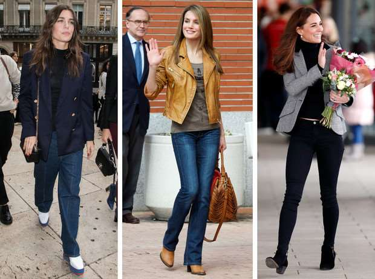
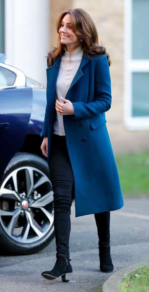
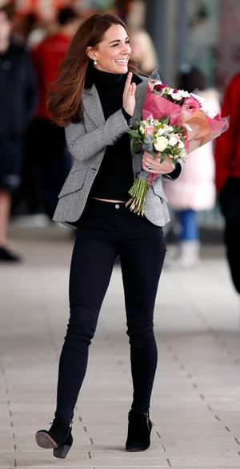

# Forbidden fruit: how royalty wears jeans

The tiredness of skirts, dresses and coats, royalty wearing something that canonical princesses we could not imagine in childhood. Namely - jeans, and not only free cut, but also brave skinny. We show all the most stylish royal images, which are unlikely to be to the taste of conservative monarchs.

Jeans have long been one of the key closet items for many women. And the royalty has successfully proved that they are no different from their subjects. Although nothing attracts so much attention as a custom-made designer dress, European royalty know that the key to an impeccable everyday outfit will always be a pair of jeans with perfect fit. We show the most stylish royal outfits with jeans, which look quite revolutionary for girls from conservative families.

## Duchess Kate

Although we are used to seeing the Duchess of Cambridge in the most chaste outfits, one of the most favorite things in her closet - jeans, in which the prince's wife looks surprisingly organic. She wears them not only to sports competitions, but also to events, where she could well put on her favorite conservative coats or her favorite flowing dresses. Simple jeans make her image more casual and as if to say that Kate is actually "her" and close to the people - this reception really works perfectly.

## Princess Diana

Princess Diana wore denim in a way that none of the royalty had dared. She easily combined jeans with sneakers and oversize jackets, added a sports bomb or trend cossacks. More than 30 years ago, Wales established the rules that are now used not only by the royal representatives, but also by the world's fashionable influencers, so her ability to wear practical things is certainly worth looking at (read also: Princess in jeans: how Diana wore denim).

## Charlotte Casiragi

Despite the fact that Grace Kelly's granddaughter rarely follows the protocol, she simply does not need it because of the distance from the Monegasque throne - in jeans she does not appear so often, but each image looks interesting. During the appearance at fashion week in Paris, she decided to try on free jeans in the style of 90's with a bulk jacket in the marine style, and a year earlier Charlotte wore a model Mom with a leather bomb with floral embroidery.
